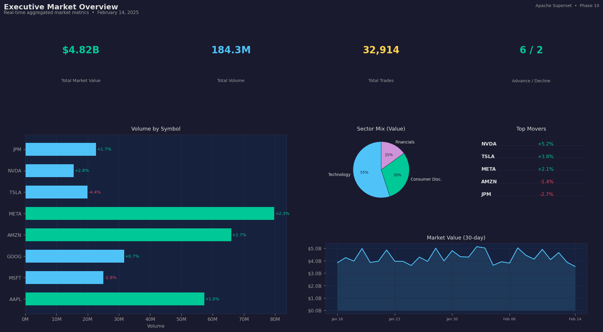
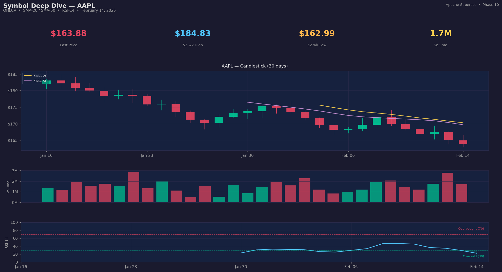
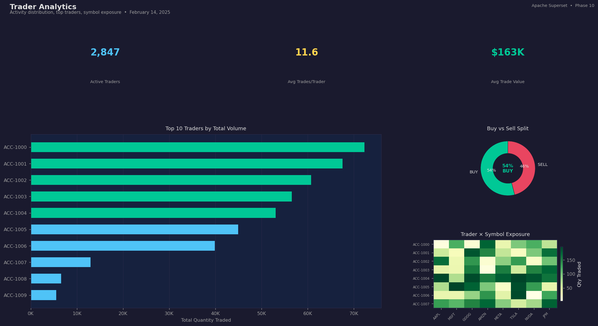
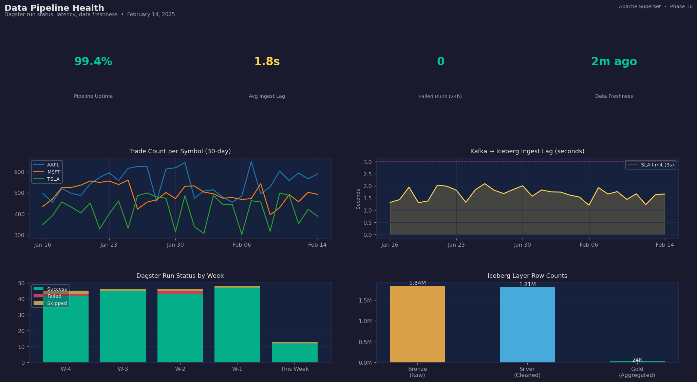
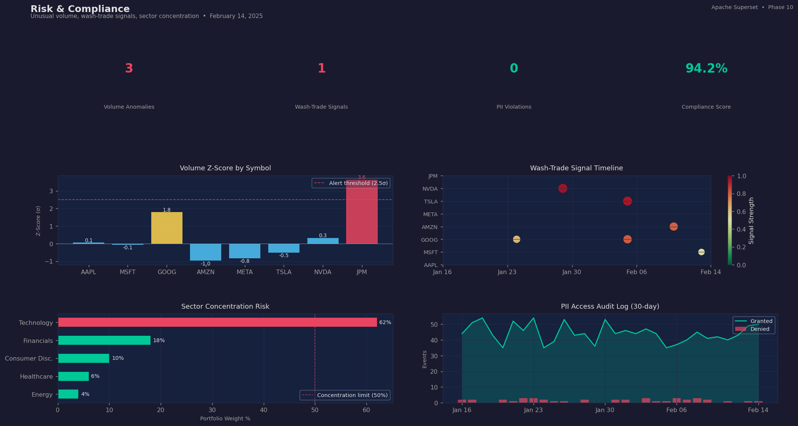
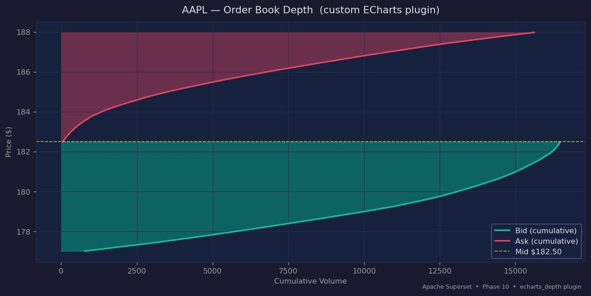

# Phase 10 — Visualization & Reporting (Apache Superset)

Apache Superset 3.1.0 BI layer sitting on top of the DuckDB/Iceberg lakehouse.
Provides five pre-built dashboards, custom ECharts visualizations, saved SQL queries,
role-based access control, scheduled reports, and threshold alerts.

---

## Architecture

```
Iceberg REST Catalog (port 8181)
         │
         ▼
  DuckDB (SQLAlchemy)   ←──── init_duckdb.sql creates 7 views
         │
         ▼
  Apache Superset 3.1.0  (port 8088)
  ├── Celery Worker  ─── async queries & alerts
  ├── Celery Beat    ─── scheduled reports (cron)
  ├── PostgreSQL     ─── Superset metadata
  └── Redis          ─── query cache + Celery broker
```

---

## Dashboards

### 1 — Executive Market Overview

Real-time aggregated market metrics: total value, volume, advance/decline ratio, sector mix, and 30-day market value trend.



**Key charts:**
- KPI tiles: Market Value, Total Volume, Trade Count, Advance/Decline
- Volume by Symbol (horizontal bar with % change)
- Sector Mix (pie — Technology / Consumer Disc. / Financials)
- Top Movers table
- 30-day Market Value line chart

---

### 2 — Symbol Deep Dive

Per-symbol technical analysis with candlestick OHLCV, moving averages, volume, and RSI momentum indicator.



**Key charts:**
- Last Price, 52-wk High/Low, Volume KPI tiles
- Candlestick chart (custom `echarts_candlestick` plugin) with SMA-20 and SMA-50 overlays
- Volume bars (green/red per candle direction)
- RSI-14 panel with overbought (70) / oversold (30) bands

---

### 3 — Trader Analytics

Trader-level activity: top contributors by volume, buy/sell split, and symbol-level exposure heatmap.



**Key charts:**
- Active Traders, Avg Trades/Trader, Avg Trade Value KPI tiles
- Top 10 Traders by Volume (horizontal bar)
- Buy vs Sell donut chart
- Trader × Symbol exposure heatmap

---

### 4 — Data Pipeline Health

Operational visibility into Dagster pipeline runs, Kafka ingestion lag, and Iceberg layer row counts.



**Key charts:**
- Pipeline Uptime, Avg Ingest Lag, Failed Runs, Data Freshness KPI tiles
- Trade Count per Symbol (30-day multi-line)
- Kafka → Iceberg Ingest Lag with SLA threshold line
- Dagster Run Status stacked bar (Success / Failed / Skipped)
- Iceberg Layer Row Counts (Bronze → Silver → Gold)

---

### 5 — Risk & Compliance

Compliance surveillance: unusual volume z-scores, wash-trade signal timeline, sector concentration, and PII audit log.



**Key charts:**
- Volume Anomalies, Wash-Trade Signals, PII Violations, Compliance Score KPI tiles
- Volume Z-Score by Symbol (alert threshold at 2.5σ)
- Wash-Trade Signal Timeline (scatter — strength encoded by size/color)
- Sector Concentration Risk with 50% limit line
- PII Access Audit Log (granted vs denied events)

---

### 6 — Order Book Depth (Custom Plugin)

Custom `echarts_depth` TypeScript plugin rendering cumulative bid/ask volume as a stepped area chart.



The plugin is registered as chart type `echarts_depth` and accepts:
- `bid_price`, `bid_quantity`, `ask_price`, `ask_quantity` column mappings
- Automatic cumulative sum and mid-price line overlay

---

## Quick Start

```bash
# 1. Copy env file and set secrets
cp .env.example .env

# 2. Start the stack
docker-compose up -d

# 3. Wait for Superset to be ready
docker-compose logs -f superset | grep "Starting gunicorn"

# 4. Bootstrap: register DB, datasets, roles, queries, alerts
docker-compose exec superset python /app/pythonpath/bootstrap/init_superset.py
```

Superset UI: http://localhost:8088  (default admin/admin — change in `.env`)

---

## Custom Visualization Plugins

| Plugin | Key | Description |
|--------|-----|-------------|
| `plugin-chart-candlestick` | `echarts_candlestick` | OHLCV candlestick with optional SMA / VWAP overlays |
| `plugin-chart-depth` | `echarts_depth` | Cumulative bid/ask order book depth chart |

Build both plugins:

```bash
./scripts/build_plugins.sh
```

---

## Saved SQL Queries (SQL Lab)

| File | Purpose |
|------|---------|
| `ohlcv_with_technicals.sql` | OHLCV + SMA-20, SMA-50, RSI-14 with Jinja `{{ symbol }}` parameter |
| `unusual_volume_detection.sql` | Symbols where volume > 2× 20-day average + z-score |
| `sector_rotation_analysis.sql` | Weekly sector net inflow/outflow |
| `trader_profile_deep_dive.sql` | Full trader summary with `{{ trader_id }}`, date range params |
| `cross_account_activity.sql` | Opposite-side same-symbol trades (wash-trade detection) |
| `daily_market_summary.sql` | End-of-day OHLC + advance/decline ratio |

---

## Role-Based Access Control

| Role | SQL Lab | Write Charts | PII Data |
|------|---------|-------------|----------|
| `TradeViewer` | ✗ | ✗ | Redacted |
| `TradeAnalyst` | ✓ | ✗ | Partial mask |
| `DataEngineer` | ✓ | ✓ | Hashed |
| `Compliance` | ✓ | ✗ | Full access |
| `admin` | ✓ | ✓ | Full access |

Row-Level Security (`ENABLE_ROW_LEVEL_SECURITY = True`) filters data per role automatically.

---

## Alerts & Scheduled Reports

| Alert | Trigger | Schedule |
|-------|---------|----------|
| High Volume Alert | Any symbol volume > 3× 20-day average | Every 5 min (market hours) |
| Data Freshness Alert | Gold layer > 30 min stale | Every 5 min |
| Daily Market Summary | — | 5 PM Mon–Fri (email to executives) |
| Daily Data Quality Report | — | 6 AM daily (email to data engineering) |

---

## Utility Scripts

```bash
# Export all dashboards to zip files
./scripts/export_dashboards.sh ./exports/

# Import dashboards from zip files
./scripts/import_dashboards.sh ./exports/

# Seed local DuckDB with 7 days of synthetic trade data for testing
python scripts/seed_test_data.py --db-path /tmp/test.duckdb --days 7
```

---

## Tests

56 tests — no live Superset or Iceberg required (uses in-memory DuckDB):

```bash
python -m pytest tests/ -v
```

| Suite | Tests | Coverage |
|-------|-------|---------|
| `test_dashboards/test_chart_queries.py` | 22 | View schema, row counts, data integrity |
| `test_data_accuracy/test_kpi_values.py` | 13 | KPI rollup correctness, VWAP, sector aggregations |
| `test_security/test_role_permissions.py` | 13 | Role definitions, RLS filters, account masking |
| `test_alerts/test_alert_conditions.py` | 11 | Alert module structure, threshold SQL, freshness |
